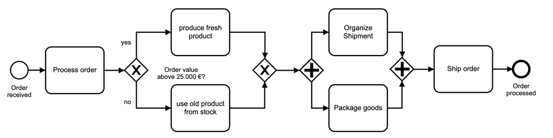

Start = StartEvent(“order received”);

End = EndEvent(“Order processed”)

Task1 = Task(Process order )

Task2.1 = Task(Produce fresh product)

Task2.2 = Task(user old product)

Task3.1 = Task(organize)

Task3.2 = Task(package goods)

Task4 = Task(Ship order)

BPMNobj = {

}

