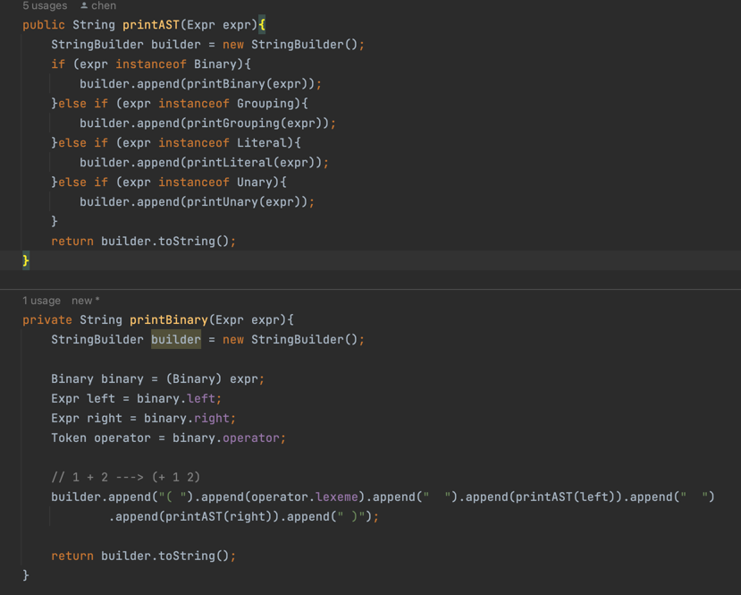
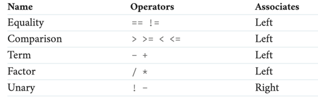
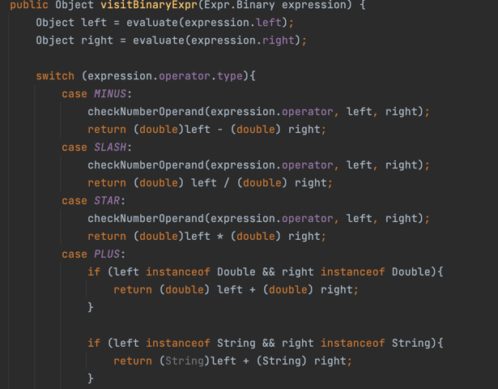
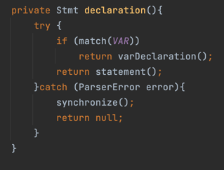
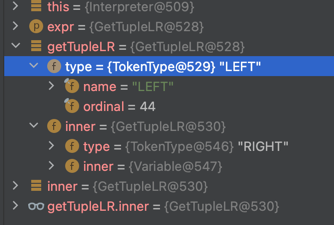

Statement / Expression precedence:
> program        → statement* EOF ; 
> 
> declaration   → varDecl | statement | funDecl | ListDecl
> 
> statement      → exprStmt | printStmt | block | ifStmt | whileStmt | forStmt | returnStmt; 
> 
> exprStmt       → expression ";" ;
> 
> printStmt      → "print" expression ";" ;
> 
> ifStmt → "if" "(" expression ")" statement( "else" statement )? ;
> 
> whileStmt    → "while" "(" expression ")" statement ;
> 
> forStmt  → "for" "(" ( varDecl | exprStmt | ";" ) expression? ";"expression? ")" statement ;
> 
> funDecl → "fun" identifier "(" parameters? ")" block;
> 
> returnStmt → "return" expression? ";"
> 
> ListDecl -> "list" ( TokenType? ) ";"

> block → "{" declaration* "}";
> 
>expression     → assignment;
> 
>assignment → IDENTIFIER "=" assignment | equality;
> 
>equality       → comparison ( ( "!=" | "==" ) comparison )* ;
> 
>comparison     → term ( ( ">" | ">=" | "<" | "<=" ) term )* ;
> 
>term           → factor ( ( "-" | "+" ) factor )* ;
> 
>factor         → unary ( ( "/" | "*" ) unary )* ;
> 
>unary          → ( "!" | "-" ) unary | call ;
> 
> call          → primary ( "(" arguments? ")" )* ;
> 
> arguments     → expression ( "," expression )* ;
> 
>primary        → NUMBER | STRING | "true" | "false" | "nil" | "(" expression ")" ;

Structure of the program:
>Literal        → NUMBER | STRING | "true" | "false" | "nil" ;
> 
>grouping       → "(" expression ")" ;
> 
>unary          → ( "-" | "!" ) expression ;
> 
>binary         → expression operator expression ;
> 
>operator       → "==" | "!=" | "<" | "<=" | ">" | ">=" | "+"  | "-"  | "*" | "/" ;

# 1. Scan
1. Read from the file or terminal.
2. Declare a token list(global).
3. For every line:   Tokenize(x : String).x : String -> List\<Token>;
    1. Scan the string char by char and match different cases through "switch".
4. Group every List\<Token> together.

> Result: Read string and output a list of tokens;

# 2. ASTPrinter
1. Define different types of Expression. every types are subclass of the Expr.
2. Define different out for each expression ( through instanceof() ).
3. Run the function recursively.
> Result: output the astTree. used for checking correctness in the later process.

# 3. Parsing Expression
1. Define the precedence and Associativity.
   - Precedence ....
   - Associativity
2. Parser:   (Only one expr, Ignore other expression)
3. Run them recursively.
4. Relation between A: {Literal, grouping, unary, binary, operator} and B: {equality, comparison,term.. }:
B can be represented by A. B is the precedence and A is the structure.
> Result: parse(x : List&lt;Toke>).x : List&lt;Token> -> Expr

# 4. Evaluate the Expression
1. Write different operations for each object in A. 
   - For example Binary
2. Run the interpreter recursively for one Expression and get the final result.
>Result：Evaluate(x : Expression).x : Expr(Expression) -> R ::= String | Boolean | Double | Null.

# 5. Statement and State
1. Add the statement to the program. Define that every Statement should end with ';'. 
2. Add some Statement class. All of these class extend the Statement class.
3. Classify the statement into different types. Separate different statement by ";".
4. Interpreter: interpreter(x: List<Stmt>).x -> Result (according to the different Stmt type).
5. 
6. Update precedence: add assignment;
7. Create Environment to store the variable. (Create a base environment), if meet'{', create new environment and 
newEnvironment.enclosing  = baseEnvironment; Recursively.

# 6. Control Flow
1. Update precedence: add ifStmt. 
2. Update precedence: add logic_or and logic_and.
3. Update precedence: add whileStmt
4. Update Precedence: add forStmt.
   - transfer to while Loop instead impl a new class.
   - for(var a = 1; a < 10; a = a + 1)
   - Block{ var a = 1; while(a < 10)Block{ Block{for body}, Block{a = a + 1} } }

# 7. Function

# 8. Type system
1. Type decl: var test1:(number, (string, number)) = tuple(2,tuple("Hello",4));
   > Parse: Var( name:= test1, 
   > initializer:= Tuple{ left:= literal(2), right:= Tuple{left:= "hello",right:= 4}}, 
   > type:= { productType, 
   > params:= < type:={Number, params = null}, type = {type:=product, Params:={String, numberType} } > })

   > Interpreter: evaluate(initializer) ---> TupleStructure()
   > tuple{ primitiveType, tuple(Primitive, Primitive)} , Type{PrimitiveType, params:=List\<Type\>{ type}}
2. If User specify the type: var a: string = "hello". add it to the env. and will report error if the 
initializer isn't string: var:string = 1 (Error); 
3. If didn't specify the type: NullType, and add the type after assign a value.
4. User can use *any* to define anyType for a variable.
5. 

# 9. Function
1. FunctionEnv: Map<String,  Function(Token name, List<Token> params, List<Stmt> body,List<Type> paramTypes)> 
2. fun:(int,int,any -> int) add(a,b,c){}
3. fun add(a,b,c){return a + b + c};
4. 
5. fun comp(f : (a,(b,c))) -> (d,e) , g : (d,e) -> f, arg1 : a, arg2:b, arg3:c ) : (a,(b,c)) -> f{
       return g(f(arg1,arg2,arg3));
   }
